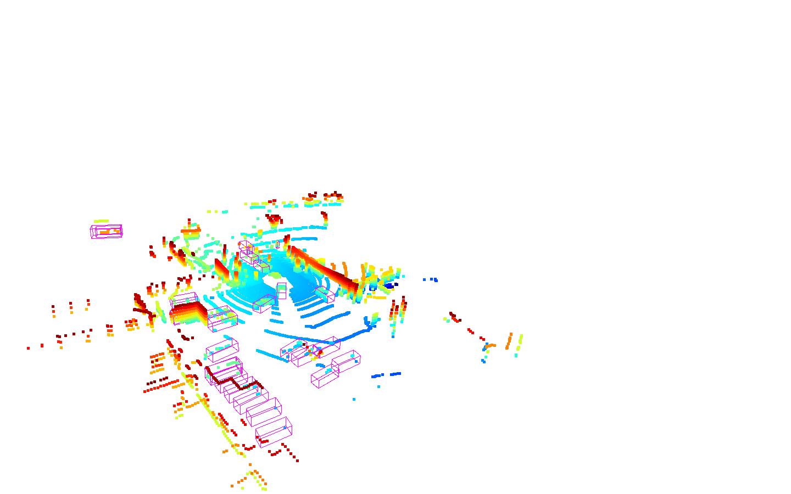

# CMPE 249 HW2 Report

**Author:** Sahus Nulu
**Repo:** https://github.com/Insainian/CMPE249-HW2

This report summarizes my experiments running 3D object detection with MMDetection3D on two datasets (KITTI and nuScenes) using four model–dataset combinations. I evaluated accuracy and runtime/memory metrics, saved all inference artifacts (PLY + JSON), visualized detections with Open3D, and prepared screenshots for a short demo video. In this repo I have put demo videos and screenshots in results/, 
logs/ contains the stdout/stderr from each run, and results/eval contains the artifacts of each run. 

## Setup Summary

**Hardware**

- Platform: SJSU HPC1
- GPU: **NVIDIA A100-PCIE-40GB**
- System memory: ~250 GB (from benchmark JSON)

**Software / Env**
- **Conda env**: `conda env create -f mmdetection3d_env.yaml -n mmdetection3d_hw2` followed by `conda activate mmdetection3d_hw2`. The YAML pins PyTorch 2.9.1 + CUDA 12.6, MMCV 2.1.0, MMDet3D 1.4.0, Open3D 0.19.0, ffmpeg, and tooling required for the assignment.
- **mmdetection3d clone**: `git clone https://github.com/open-mmlab/mmdetection3d.git $HOME/mmdetection3d`.
- **HPC1-specific MMCV build**: Pre-built wheels failed on CUDA 12.6; rebuilt MMCV v2.1.0 from source with NVHPC CUDA 12.6 toolchain (steps also in README).
```bash
 conda activate mmdetection3d
 pip uninstall -y mmcv mmcv-full mmcv-lite numpy
 pip install 'numpy<2'

module load nvhpc-hpcx-cuda12/24.11
export CUDA_HOME=/opt/ohpc/pub/apps/nvidia/nvhpc/24.11/Linux_x86_64/24.11/cuda/12.6
export MATH_LIB_HOME=/opt/ohpc/pub/apps/nvidia/nvhpc/24.11/Linux_x86_64/24.11/math_libs/12.6/targets/x86_64-linux
export CPATH=$CPATH:$CUDA_HOME/targets/x86_64-linux/include:$MATH_LIB_HOME/include
export LIBRARY_PATH=$LIBRARY_PATH:$CUDA_HOME/targets/x86_64-linux/lib:$MATH_LIB_HOME/lib
export LD_LIBRARY_PATH=$LD_LIBRARY_PATH:$CUDA_HOME/targets/x86_64-linux/lib:$MATH_LIB_HOME/lib
export PATH=$CUDA_HOME/bin:$PATH

export CC=$(command -v gcc)
export CXX=$(command -v g++)
export TORCH_CUDA_ARCH_LIST="6.0 8.0"
export MMCV_WITH_OPS=1
export FORCE_CUDA=1

rm -rf build/ mmcv.egg-info/
python setup.py build_ext --inplace
pip install -v . --no-build-isolation --no-deps
```
- **Datasets**: KITTI and NuScenes staged at `$M3D/data/`. NuScenes info files regenerated to avoid stale metadata.
```bash
cd $M3D
conda activate mmdetection3d
rm -f data/nuscenes/nuscenes_infos_*.pkl
PYTHONPATH=. python tools/create_data.py nuscenes \
  --root-path ./data/nuscenes \
  --out-dir   ./data/nuscenes \
  --extra-tag nuscenes
```

- **Pretrained Models**: Used MMDetection3D checkpoints for all experiments.
```bash
mim download mmdet3d --config <config-name> --dest $M3D/modelzoo_mmdetection3d
```

- **Helper env vars**:
```bash
  export HWREPO=/fs/atipa/home/<student_id>/CMPE249-HW2
  export M3D=/home/<student_id>/mmdetection3d
```

## Models, Datasets, and Commands
All runs use `detection3d/simple_infer_main.py` with the template:
```bash
python detection3d/simple_infer_main.py \
  --config <config.py> \
  --checkpoint <model.pth> \
  --dataroot <dataset_root> \
  --dataset <kitti|nuscenes> \
  --data-source cfg \
  --ann-file <info.pkl> \
  [--eval --eval-backend runner | --max-samples 200] \
  --device cuda \
  [--no-open3d] [--no-save-images] \
  --out-dir <results_subdir>
```

| Dataset | Model | Eval Command                                                                       | Inference Command                                                                                   | Config |
| --- | --- |------------------------------------------------------------------------------------|-----------------------------------------------------------------------------------------------------| --- |
| KITTI | 3DSSD | `... --eval ... --out-dir results/kitti_3dssd_eval` -> `logs/kitti_3dssd_eval.log` | `... --max-samples 200 --no-open3d --out-dir results/kitti_3dssd_viz` -> `logs/kitti_3dssd_viz.log` | 3dssd_4x4_kitti-3d-car.py |
| KITTI | PointPillars | `... --eval ... --out-dir results/kitti_pointpillars_eval`                         | `... --max-samples 200 --no-open3d --out-dir results/kitti_pointpillars_viz`                        | pointpillars_hv_secfpn_8xb6-160e_kitti-3d-car.py |
| NuScenes | PointPillars | `... --eval ... --out-dir results/nuscenes_pointpillars_eval`                      | `... --max-samples 200 --no-open3d --no-save-images --out-dir results/nuscenes_pointpillars_viz`    | pointpillars_hv_secfpn_sbn-all_8xb4-2x_nus-3d.py |
| NuScenes | CenterPoint | `... --eval ... --out-dir results/nuscenes_centerpoint_eval`                       | `... --max-samples 200 --no-open3d --no-save-images --out-dir results/nuscenes_centerpoint_viz`     | centerpoint_pillar02_second_secfpn_head-circlenms_8xb4-cyclic-20e_nus-3d.py |

For visualization runs I added:

- --max-samples 200

- --no-open3d (HPC has no display)

- --no-save-images on nuScenes to avoid a KeyError: 'lidar2img' in the image visualization branch.

This produced, per sample:
- PLY point clouds with predictions (*_points.ply, *_pred.ply)
- Per-frame JSON with boxes/scores/classes
- A benchmark_results.json summarizing accuracy + latency + peak memory

## Quantitative Results
Metrics captured from `results/*/benchmark_results.json`. Latency reflects `mean_latency_ms` (lower is better). Memory is `max_peak_mem_mb`.

I use 3D AP40 @ IoU 0.7 (Moderate) as the main KITTI accuracy metric and nuScenes mAP/NDS for multi-class performance. 
Calculated FPS with 1000 ms/s / mean_latency_ms.

| Dataset | Model | Key Accuracy Metrics | Latency (ms) | ≈FPS | Peak Mem (MB) |
| --- | --- | --- | --- |------|---------------|
| KITTI | 3DSSD | `Car_3D_AP40` easy/mod/hard: **90.8 / 79.9 / 78.2** | **51.6** | 19.4 | 33,577        |
| KITTI | PointPillars | `Car_3D_AP40` easy/mod/hard: **90.3 / 79.1 / 76.1** | **13.9** | 71.9 | 3,015         |
| NuScenes | PointPillars | `mAP`: **0.337**, `NDS`: **0.486** | **339.9** | 3.0  | 27,397        |
| NuScenes | CenterPoint | `mAP`: **0.482**, `NDS`: **0.591** | **132.4** | 7.6  | 12,646        |

> Additional NuScenes metrics (mATE/mAOE, per-class AP) remain in each JSON for detailed analysis.

**nuScenes per-class highlights:**

**PointPillars:**

- Car AP ≈ 0.787, Pedestrian AP ≈ 0.567
- Construction vehicle and bicycle AP are very low (0.058 and 0.008)

**CenterPoint:**
- Car AP ≈ 0.836, Pedestrian AP ≈ 0.762
- Consistently higher AP across most classes, including truck, bus, trailer, motorcycle, bicycle, barrier, and traffic cone.

## Screenshots and Demo Video

On my Mac, I installed Open3D and used the modified viewer:

```bash
python open3d_view_saved_ply.py \
  --dir results/<dataset_model>_viz \
  --view-json results/<dataset_model>_viz/view.json \
  --basename <frame_index>
```
To get the JSON, run without --view-json first to generate it. Move it around in the pop-up window to get a good view, then press H to see
the commands. Usually it will be command/ctrl + c to copy the view settings to clipboard. Paste it into a file named view.json

**Screenshots**: (Have 4 of each dataset - model combination; only 1 shown per combo here)
- KITTI - 3DSSD:


- KITTI - PointPillars:


- NuScenes - PointPillars:


- NuScenes - CenterPoint:


**Demo Video**: stitch frames (e.g., KITTI 3DSSD) via ffmpeg and save `results/demo.mp4`.

```bash
cd results/nuscenes_pointpillars_viz/frames
ffmpeg -framerate 7 -i frame_%04d.png \
  -c:v libx264 -pix_fmt yuv420p \
  nuscenes_pointpillars_viz.mp4
```
The following is the demo video for NuScenes PointPillars:
<video src="https://raw.githubusercontent.com/Insainian/CMPE249-HW2/refs/heads/main/results/nuscenes_pointpillars_demo.mp4" controls width="600"></video>


## Key Takeaways

1. **Latency vs Accuracy trade-off on KITTI**: PointPillars delivers near-identical Car AP40 to 3DSSD (<=1.7 pt gap) while being ~3.7× faster (13.9 ms vs 51.6 ms) and using 10× (3GB GPU memory comapred to 33GB) less GPU memory, making it ideal for real-time demos.


2. **NuScenes benefits from CenterPoint**:
- CenterPoint improves mAP by +14.5 points and cuts latency to 132 ms compared to PointPillars (340 ms)
- NDS improves from 0.486 -> 0.591.
- Error metrics also improve: mATE drops from 0.426 -> 0.326, mAOE from 0.530 -> 0.364.
- It also boosts per-class AP across nearly all categories.
- On top of that, it has lower memory usage (12.6GB vs 27.4GB).


This highlights the value of voxel-based center detection in crowded scenes.
3. **Class imbalance remains challenging**: Both NuScenes models struggle on construction vehicles/trailers (AP <0.21) per JSON metrics. Extra fine-tuning or data augmentation is needed for rarer categories.
4. **KIITI vs nuScenes**: KITTI's single-class Car detection allows simpler models (PointPillars, 3DSSD) to excel with high AP and low latency. NuScenes' multi-class complexity benefits from advanced architectures like CenterPoint for balanced performance across categories.
However, nuScenes overall mAPs remain lower due to multiple classes and scene complexity.

## Limitations/Future Work

- I did not perform any fine-tuning or training from scratch. All experiments use pretrained MMDetection3D checkpoints.
- KITTI analysis focuses on the Car class.
- For nuScenes, I had to run inference with --no-save-images to avoid lidar2img issues, then generate frames from PLY offline.
- Runtime and memory were measured on a single A100-40GB GPU with the given configs. Future work could involve changing batch sizes or hardware to change FPS.


